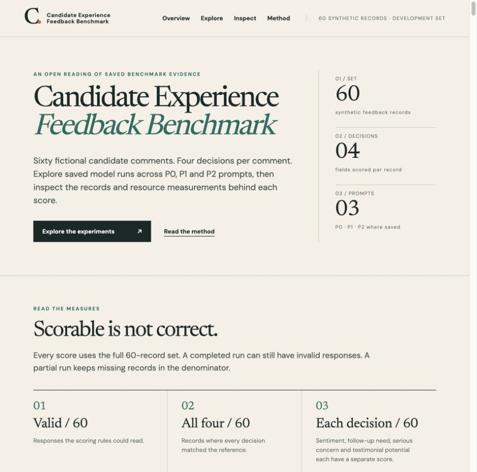

# Candidate Experience Feedback Benchmark

[](results/comparison/REPORT.md)
[](#what-the-models-decide)
[](https://adambkovacs.github.io/candidate-experience-benchmark/)
[](LICENSE)

**How well can TypeSafe Jev and general-purpose language models classify feedback written by candidates about their hiring experience?**

This project compares their responses to the same 60 fictional reviews, complaints and potential testimonials. Each method makes four judgments. Saved results include output validity, agreement with provisional references, prompt variations, request times, token counts and costs where recorded.

[Explore the results](https://adambkovacs.github.io/candidate-experience-benchmark/) · [Read the evidence report](results/comparison/REPORT.md) · [See the method](docs/PLAN.md)

[](https://adambkovacs.github.io/candidate-experience-benchmark/)

## What the models decide

| Judgment | Question |
| --- | --- |
| Sentiment | Is the candidate's experience positive, negative, mixed, neutral, or unclear? |
| Follow-up needed | Does this feedback call for a response or action? |
| Serious concern reported | Does the candidate report a concern that warrants escalation? |
| Testimonial potential | Could this feedback be considered for a testimonial, subject to permission and review? |

The task concerns candidates' experience of a process. It does not assess their suitability for a job. All reviews are synthetic; no invented testimonial is a real endorsement.

## Jev alongside the alternatives

TypeSafe Jev is the starting point for this comparison. The roster also includes OpenJev, SemIf, AnyJev, Laya and NLI specialists; GPT and Claude subscription configurations; Gemini; and hosted Qwen, Gemma, DeepSeek and Mistral configurations. Exact model, effort, route and controls matter: two rows sharing a model family are not necessarily the same experiment.

The saved TypeSafe Jev development result has **60 valid outputs out of 60**, with **all four judgments agreeing on 54 of 60 reviews**. Its recorded development cost estimate is **$0.00589**. That is a token-price estimate, not a provider-confirmed charge. The timing evidence includes 61 requests because one failed request preceded a successful continuation. See the [source report](results/comparison/REPORT.md) and [specialist registry](results/specialist-run-registry.json).

These are development findings, not a held-out leaderboard. The same AI assistant drafted and reviewed the reference labels. There has been no independent human adjudication. A model matching those references does not establish real-world reliability or general model quality.

## Does the prompt change the result?

| Condition | What changes |
| --- | --- |
| P0: baseline | The original task, rubric and output schema. |
| P1: classifier framing | An explicit classifier role and task instructions. |
| P2: SOP and decision tree | Classifier framing plus a procedure for making the judgments. |

Prompt comparisons have run. The [38 audited paired comparisons](results/prompt-comparison-v1-2026-09-24/paired-reports/thirty-eight-eligible-comparisons.html) preserve eligibility checks. Other saved outcomes can be descriptive without qualifying as a controlled P0/P1/P2 comparison. Native classification interfaces do not automatically have equivalent generative prompt conditions.

Batch-context baselines remain separate from historical single-record runs. Missing results and invalid outputs remain visible; they are not dropped to improve a score. Read the [prompt protocol](docs/PROMPT_VARIANTS.md) for the exact distinctions.

## Reading the numbers

- **Valid / 60** counts responses that meet the output contract. A valid response can still disagree with every reference judgment.
- **Each judgment / 60** counts agreement for that field. **All four / 60** requires every judgment on a review to agree.
- **Request time** measures the recorded execution surface. A request may contain one review or a batch of ten. Summed request time is not necessarily elapsed wall time when requests overlap.
- **Tokens** use the provider's reported fields. Missing usage is unknown, not zero; cache and reasoning counts retain their provider meanings.
- **Cost** distinguishes observed API charges, estimates and unknown-charge bounds. Subscription fees and local hardware costs are not allocated per run.

Local timing depends on the recorded Mac, runtime and quantization. It is diagnostic evidence, not a hosted speed ranking. Hosted replacements have their own identities; a hosted result does not overwrite a local measurement.

## Reproduce the offline checks

```sh
git clone https://github.com/adambkovacs/candidate-experience-benchmark.git
cd candidate-experience-benchmark
python3 scripts/development_benchmark.py validate
python3 -m unittest discover -s tests -q
node --test tests/*.cjs
```

These checks do not launch paid inference. Runner-specific dependencies and instructions are in [development setup](docs/RUN_DEVELOPMENT.md) and [MVP run notes](docs/RUN_MVP.md).

To serve the saved public view locally:

```sh
python3 -m http.server 8768
# Open http://localhost:8768/public-site/
```

The website is static. Its published bundle contains an allowlisted result export and site assets; it needs no API key or backend. See [publishing notes](docs/PUBLIC_EXPLORER.md).

## Data and evidence

| Start here | Contents |
| --- | --- |
| [60 inputs](data/pilot/inputs.jsonl) | Fictional candidate feedback used for this development run |
| [Labeling guide](docs/LABELING_GUIDE.md) | Judgment definitions and decision rules |
| [Provisional references](data/pilot/proposed_labels.jsonl) | Offline scoring labels, excluded from inference requests |
| [Output schema](schemas/judgments.schema.json) | Required fields and allowed values |
| [Pilot audit](docs/PILOT_AUDIT.md) | Dataset and reference limitations |
| [MVP status](docs/MVP_STATUS.md) | Operational progress and outstanding work |
| [Harness research](docs/HARNESS_RESEARCH.md) | Options for reducing manual coordination in later runs |

The broader plan describes 400 records. **Only the 60 development records are in scope for this run; the remaining 340 have not been generated.** Future validation and test sets need separate authorization and independent reference review.

The repository was previously named `recruitment-feedback-demo`. Historical evidence retains original paths and identifiers so its hashes and provenance remain intact.

## License

This project is licensed under the [MIT License](LICENSE). Third-party dependencies and model weights retain their respective licenses.
