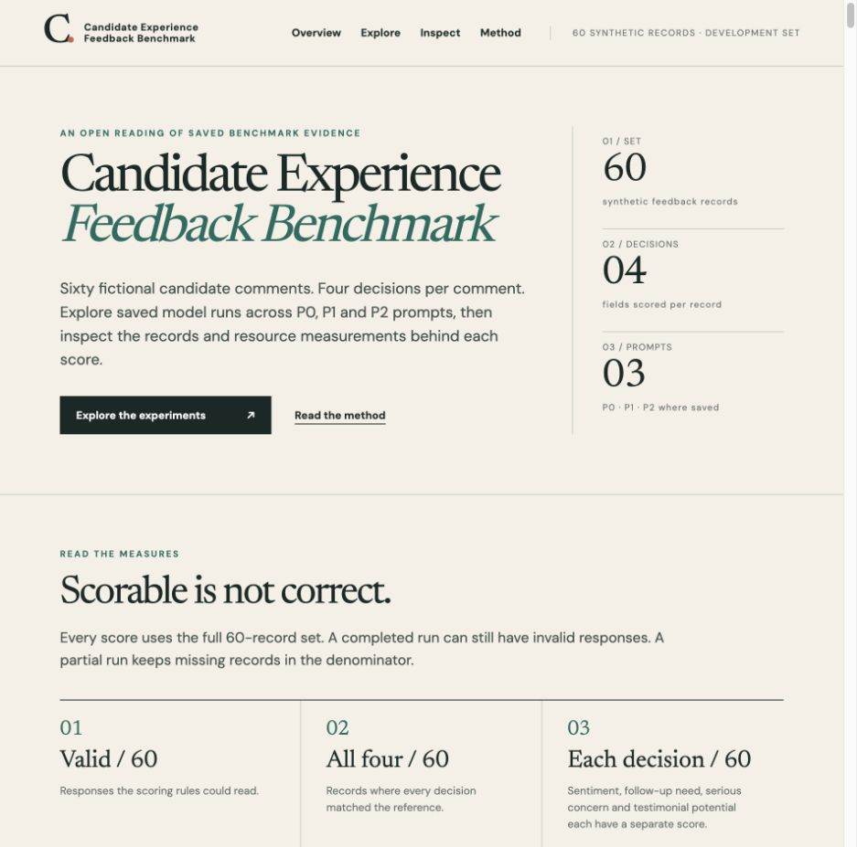

# Candidate Experience Feedback Benchmark

[](results/comparison/REPORT.md)
[](#what-the-models-decide)
[](https://adambkovacs.github.io/candidate-experience-benchmark/)
[](LICENSE)

**How well can TypeSafe Jev and general-purpose language models classify feedback written by candidates about their hiring experience?**

This project compares their responses to the same 60 fictional reviews, complaints and potential testimonials. Each method makes four judgments. Saved results include output validity, agreement with provisional references, prompt variations, request times, token counts and costs where recorded.

[Explore the results](https://adambkovacs.github.io/candidate-experience-benchmark/) · [Read the evidence report](results/comparison/REPORT.md) · [See the method](docs/PLAN.md)

[](https://adambkovacs.github.io/candidate-experience-benchmark/)

## Explore the findings

The expanded explorer lets you choose **decision models, general-purpose LLMs, or all models**, then inspect a saved run and its source report. The [coverage audit](docs/DEEP_DIVE_COVERAGE_2026-10-07.md) accounts for 1,004 selectable run entries, including repeats and partial runs; these reuse the same 60 reviews and are not independent test sets. All 1,004 entries now include individual answers or explicit invalid, failed, unknown or unsent outcomes across the same 60 review positions. Each entry retains its source evidence and run identity.

The new [review comparison](results/disputed-reviews-v1/README.md) shows all 60 comments and the exact first-pass answers from seven native decision models. Filter for potential testimonials or a particular decision field to see which models disagreed with the frozen reference. That view deliberately uses one pass per model, so a model with more repeat runs does not receive extra weight.

The [release reconciliation](docs/ANALYSIS_RELEASE_RECONCILIATION_2026-10-07.md) maps the current evidence, denominators, findings and limits. A [meetup presentation preview](https://adambkovacs.github.io/candidate-experience-benchmark/presentation.html) is being published from the same saved results; rendered verification remains pending.

Five findings are useful when planning a classification pilot:

- **More instructions did not consistently help.** Clef's three prompt versions scored 54, 51 and 49 out of 60 in every OpenRouter pass. Flash improved with classifier instructions. The effect depends on the exact setup. [Prompt comparisons](docs/CLEF_OPENROUTER_FINDINGS.md).
- **Consistent answers can still disagree with the reference.** Perplexity scored 54/60 in all nine runs, with identical answers across repeats of each prompt. Repeatability and reference agreement measure different things. [Perplexity evidence](results/perplexity-decider-v1/full-v2/findings.json).
- **Overall scores hide different mistakes.** Only nine reviews are reference-positive testimonials; answering “no” every time already matches 50/60 testimonial labels. In the first native P0 comparison, Tev found all nine positives but added three false positives. [Field-level analysis](results/analysis-native-cohort-v1/README.md).
- **Some disagreements concern the task boundary or ambiguous references.** All seven native models in the review panel missed the complete reference for the off-topic restaurant comment. Of 32 general-model configurations in the declared first-pass comparison, 13 matched it, four had no usable answer and 15 disagreed. Routes and instructions differ, so this does not establish a model-family advantage. Read the comments and answers alongside the scores. [Cross-category findings](results/cross-category-v1/findings.md) · [Review examples](results/disputed-reviews-v1/README.md).

- **Two models agreeing does not guarantee a correct answer.** An offline rule that accepts only identical four-field answers would retain 33–53 of the 60 reviews, depending on the pair, with 0–4 retained reference disagreements. The remaining reviews would need human review. All 21 pairs are reported; none is selected as a validated production choice. [Agreement and review workload](results/native-agreement-policy-v1/README.md).

These observations describe 60 synthetic reviews with human-checked, provisional references. They do not establish performance on new candidates' feedback or prove that model architecture caused a difference.

<details>
<summary>Detailed model findings and historical checkpoints</summary>

Perplexity Decider completed all nine prompt/repeat runs through OpenRouter: **540 of 540 development responses were valid**, and every run matched all four reference answers on **54/60 reviews**. Repeats were identical within each prompt. The base task and decision rules produced identical labels; classifier instructions changed two decisions on the off-topic restaurant review without changing the total. Development calls cost **$0.14296**; including smoke tests, the observed total was **$0.15010**. [Exact results and costs](results/perplexity-decider-v1/full-v2/findings.json).

The [six-model first-pass analysis](results/analysis-native-cohort-v1/README.md) compares field errors, testimonial detection and observed costs. Solar scored 55/60 overall, while Tev found all nine reference-positive testimonials with three extra positives. The same overall score can therefore conceal different practical tradeoffs. Remaining Mistral execution was excluded at the owner's request; its historical results remain available.

Clef, Clef Flash and Luna Decisions have now completed their planned OpenRouter requests: **three passes for each of three prompt versions**. Clef scored **54/60 with the base task, 51/60 with classifier instructions and 49/60 with decision rules** in every pass. Luna scored **49/51/49**, also unchanged across passes. Flash scored **45/47/46** in its first two passes; the final decision-rule pass scored **45/60 because one answer was lost to a provider rate limit**. Its other 59 answers matched the earlier passes exactly. No model changed a label between repeats on reviews with answers available for comparison. Added instructions helped some models and hurt others; consistent answers were not necessarily correct. [Prompt comparisons, field errors, costs and limitations](docs/CLEF_OPENROUTER_FINDINGS.md).

Solar Decide's three passes scored **55/53/54 with the base task**, **53/52/51 with classifier instructions**, and **53/52/52 with decision rules**, all out of 60. Classifier instructions reduced full matches in every pass. Eight runs returned all 60 answers; the final decision-rule run has 59 and one preserved timeout. A confidence threshold of 0.9 on the first baseline's sentiment answers retained 31 reviews, including three disagreements with the reference key. Known development charges total **$0.20325475**, excluding smoke tests and the unresolved request. [Full Solar results, prompt changes and confidence limits](public-site/solar-decide-full-findings.json).

DeepSeek V4.1 Flash at low effort has closed its final three prompt passes: **58/60** for the base task, **57/60** with classifier instructions and **58/60** with decision rules. The base task and classifier version each lost one answer to truncation, on different reviews. Among the 59 reviews valid for both the base task and decision rules, one sentiment label changed despite identical all-four totals. [Final passes and paired changes](public-site/deepseek-low-fresh3-findings.json).

Gemini 3.1 Pro Preview at high effort completed all nine planned runs on the same 60 reviews. Across three passes, the base task scored **55, 56 and 56/60**; classifier instructions scored **56, 56 and 56/60**; decision rules scored **55, 56 and 56/60**. Neither added prompt improved the score consistently in matched passes. Some individual answers changed even when the total score did not. [Repeat results](public-site/gemini-repeats.json) · [Analysis](docs/ANALYSIS_REFRESH_2026-10-05.md).

Liquid d1 completed **all nine planned runs**, each with 60 valid answers. Its three base-task passes scored **43/60** with identical labels. Classifier-instruction passes scored **42, 44 and 42/60**; three reviews changed a label across repeats. Decision-rule passes all scored **41/60**, with identical labels. Added instructions did not consistently improve agreement on these reviews. These are repeated answers to the same 60 cases. [Liquid results, token use and costs](public-site/liquid-d1-native-full-findings.json).

Hosted Qwen3.6 with thinking enabled has eight clean completed phases and one interrupted phase. Across three passes, the base task scored **54, 53 and 51 out of 60**, while decision rules scored **56, 56 and 54**. Classifier instructions scored **54 and 57** in the two clean passes. In the third pass, classifier instructions added six full matches over the base task; decision rules added three. More detailed instructions did not consistently produce the best score. All clean phases returned 60 valid answers. The first classifier-instruction pass remains a separate interrupted composite with 59 valid answers and one unknown outcome, so it cannot supply a clean three-pass comparison. Across the clean repeats, at least one label changed on **5/60 baseline reviews**, **7/60 decision-rule reviews**, and **6/60 classifier-instruction reviews**. The first two counts cover three passes; the last covers two. Follow-up-needed labels stayed identical. Similar totals therefore do not mean each review received the same classification. [Saved hosted results](public-site/additional-hosted-fresh-repeats.json).

Tev returned usable answers in all **nine runs (540 responses)**. Each prompt produced identical labels across its three repeats: base-task scores were **45/60**, classifier instructions **44/60**, and decision rules **44/60**. The two instruction variants changed six reviews despite equal scores. Stable output did not mean every decision matched the reference. Development requests cost **$0.151342128**, excluding smoke tests. [Field results, confidence thresholds and evidence](public-site/tev-native-full-findings.json).

DeepSeek V4.1 Flash at high effort scored **57/60** in its first base-task run and **57/60** with classifier instructions. Each run had 59 usable answers, but different reviews produced unusable outputs: DEV-030 for the base task and DEV-006 for classifier instructions. The same total can hide different missing answers. [Saved hosted results](public-site/additional-hosted-fresh-repeats.json).

DeepSeek high's revised price-control configuration closed its first decision-rule (P2) phase with **60 valid answers and 58/60** all-four matches. Development cost was **$0.03250234680**. The earlier P0 and P1 phases used different price controls, so these scores are separate observations, not a matched prompt comparison. [Closure evidence](results/repeatability-v1/deepseek-high-remaining7-price-v1/execution-adapter-v1/fresh1/P2/closure.review.json) · [Hosted results](public-site/additional-hosted-fresh-repeats.json).

Later DeepSeek high runs scored **58/60** with both the base task and classifier instructions. The base-task run had one truncated answer; the classifier run had 60 valid answers. Their equal scores therefore hide a difference in usable output. A later decision-rule run scored **56/60** after its unsent reviews were completed, retaining one provider failure. The second and third classifier-instruction passes both scored **58/60**, but DEV-030 changed a label. In the third pass, classifier instructions and decision rules also scored **58/60** while differing on DEV-030. Equal scores do not establish identical classifications. The final third base-task pass also scored **58/60**, with 58 valid answers and two truncated responses (DEV-006 and DEV-030). All six scheduled continuation stages are now closed; earlier provider and format failures remain part of the evidence. These later results and their costs are recorded separately in the [continuation report](public-site/deepseek-high-remaining6-successor-findings.json).

DeepSeek low now has descriptive scores for all three prompt conditions in its first pass: **58/60, 57/60 and 53/60** for the base task, classifier instructions and decision rules. The decision-rule result retains one invalid answer and three earlier failures; all ten previously unsent reviews are now valid full matches. Among reviews answered validly under both prompts, two four-field answers changed from the base task to decision rules. The interrupted result is not a clean repeat. [Comparison, costs and token coverage](docs/DEEPSEEK_LOW_FINAL_SUFFIX_FINDINGS_2026-10-06.md).

A later DeepSeek low decision-rule run, under revised price controls, produced **57/60 full matches and 59 valid answers**. DEV-005 returned a provider error with no usable answer or reported charge; the last 55 reviews were completed separately. Known development charges total **$0.030564226637**, excluding smoke tests, with a separate **$0.06905856** upper bound retained for the unknown request. It is an interrupted result, not a clean repeat or proof of improvement over the earlier run. [Score details and evidence limits](public-site/deepseek-low-remaining6-price-v2-findings.json).

The second DeepSeek low classifier-instruction pass has **57/60 full matches**. All 57 usable answers matched the references, but two responses were truncated (DEV-006 and DEV-030), and DEV-027 failed at the provider with an unknown charge. Those outcomes remain in the denominator; this is an interrupted result, not a clean repeat. Known development cost is **$0.030730605596**, with **$0.06905856** retained as an unknown-charge upper bound. [Outcomes and source evidence](public-site/deepseek-low-p1-successor-findings.json).

The next Qwen3.5 4B thinking-on base-task pass completed with **48/60** full matches, 52 valid answers and eight invalid outputs. Its host checks passed without a sleep interruption. Three of nine planned phases now have completed results; the earlier interrupted P0 remains separate. [Source-bound results](public-site/legacy-qwen-repeats.json).

Qwen3.5 4B thinking-on has closed its first P1 and P2 passes: **47/60 and 50/60 all-four matches**, respectively. Each has 51 valid responses and nine invalid outputs. Among the 47 reviews valid in both passes, two changed sentiment under P2 and became full matches. This is one matched prompt comparison; repeatability is still untested. The next P2 smoke stopped when DEV-001 exhausted the 4,096-token output limit without returning JSON. Its full pass was not sent. [P1 and P2 findings](docs/QWEN35_P1_FIRST_PASS_2026-10-06.md).

Qwen3.5 4B thinking-on matched all four reference fields on **47/60** reviews in its first new P0 pass, or **47/51** among valid answers. The pass was interrupted by low-power sleep; a separate continuation sent only the eight remaining reviews. Combined results retain 51 valid answers, eight invalid answers and one unknown outcome. This descriptive result is not a clean repeat. The sleep-spanning timeout cannot measure inference time. [Interruption evidence](docs/QWEN35_P0_INTERRUPTION_2026-10-06.md).

Clef's first classifier-instruction (P1) pass scored **52/60**, compared with **53/60** for its matched base-task pass. Four reviews changed an answer; one gained a full match and two lost one. All 60 responses were valid. The two later P1 passes scored 51/60 each; one review changed an answer between the first and later passes. All three P0 passes scored 53/60 with identical labels. The only clean P2 pass scored 49/60. Two other P2 attempts remain interrupted, so they cannot establish three-pass stability. [Closed repeat findings and interrupted outcomes](public-site/clef-closed-repeat-findings.json). Reported usage was 144,694 input tokens and zero output tokens, with a $0.03472656 published-price estimate rather than a provider bill. [First P1 findings](docs/CLEF_P1_FIRST_PASS_2026-10-05.md).

Cloudflare Clef and Clef Flash have native P0 results on the same 60 reviews. Clef scored 53/60 in each of its three P0 passes. Clef Flash scored 45/60 in its first two P0 passes; its third remains unscored after two unknown outcomes, leaving 58 reviews unsent. The [5 October continuation](docs/CLEF_FLASH_P0_SUFFIX_CHECKPOINT_2026-10-05.md) returned no usable prediction and did not change earlier scores. In three P1 passes, Clef Flash scored 47/60 each time, with no observed changes to predictions, native probability distributions or vendor confidence. In the matched fresh1 comparison, P1 scored 47/60 against P0's 45/60; DEV-027 and DEV-044 became all-four matches, with no losses. This single prompt contrast is descriptive. Provider-billed dollars and pure inference latency are unavailable. [P1 findings](docs/CLEF_FLASH_P1_FINDINGS_2026-10-05.md) · [third P0 checkpoint](docs/CLEF_P0_THIRD_CHECKPOINT_2026-10-02.md).

Mistral 119B fresh1 P0 returned 55 valid answers and five failed requests. It matched all four provisional reference fields on 40/60 records, or 40/55 among valid answers. This interrupted pass is not a repeat result; its failures and unknown-charge bound remain visible in the [partial findings](public-site/mistral119-fresh1-p0-findings.json). The subsequent P1 smoke stopped on an upstream HTTP 429 before returning a prediction. It adds no P1 score and leaves the P0 findings unchanged. [P1 smoke record](results/repeatability-v1/mistral119-fresh-matched3-v1/p1-successor-v1/smoke.terminal-public.json).

Gemma 26B thinking-on now has descriptive fixed-60 scores for all nine planned repeat runs. Its third decision-tree (P2) pass has **56/60** all-four matches, 58 valid answers and two preserved request failures; the three P2 scores are 57, 56 and 56. [P2 changes and failure counts](docs/GEMMA26_P2_REPEAT_FINDINGS_2026-10-02.md). The three base-task (P0) passes scored **59, 56 and 58/60**, with the second retaining one failed request. [P0 scores and usage](docs/GEMMA26_FRESH3_P0_CHECKPOINT_2026-10-02.md). The three classifier-instruction (P1) passes scored **58, 58 and 57/60**. The third has 59 valid answers and retains the DEV-059 timeout with a full unknown-charge bound; DEV-060 was sent once and returned a valid answer. Among the 59 reviews valid in all three P1 passes, one classification vector changed from the first to the third pass. [P1 interrupted findings](docs/GEMMA26_FRESH3_P1_INTERRUPTED_2026-10-02.md). These preserved failures make the nine-run series descriptive, not a clean matched-three experiment.

The [5 October analysis update](docs/ANALYSIS_REFRESH_2026-10-05.md) adds Clef Flash P1/P2 and Mistral 119B fresh1 P0 to the combined source-bound feed while retaining earlier cohort cutoffs. [See the updated comparison](https://adambkovacs.github.io/candidate-experience-benchmark/#analysis-update). Across the earlier 17 Claude configurations and four new Sonnet settings, neither added-instruction prompt beat the base task in all three passes for any configuration. That result describes within-configuration repeats, not a controlled comparison between models.

The [visual findings](https://adambkovacs.github.io/candidate-experience-benchmark/#findings) explain prompt changes, Jev's disagreements, difficult reviews and observed costs. The [analysis report](docs/FINDINGS.md) gives the interpretation and links to saved evidence. A separate [analysis of seven hosted continuation runs](docs/HOSTED_CONTINUATION_FINDINGS_2026-09-28.md) compares field changes and output failures. Those runs departed from the planned schedule and remain outside the strict paired cohort.

- Adding a decision tree after classifier framing reduced agreement in 21 of 39 audited hosted/subscription setups, improved it in 4, and left 14 unchanged. Extra instructions did not consistently help.
- The 18 Codex configurations in the published repeat cohort completed their three-pass studies. Classifier instructions improved agreement in every pass for two configurations; decision-tree instructions did so for none. [See the repeat analysis](docs/CODEX_REPEAT_SYNTHESIS_2026-09-28.md).
- SemIf matches 54/60 testimonial labels in its completed native passes, but identifies only four of nine reference-positive testimonials. [Class-level findings explain the difference](docs/SEMIF_REPEAT_FINDINGS_2026-09-28.md).
- SemIf completed three fresh generated-output passes per prompt. Each P0 pass matched all four labels on 35/60 reviews; P1 matched 26/60 and P2 matched 43/60 in each pass. No answer changed among reviews valid in all three passes: 0/52 for P0, 0/38 for P1 and 0/58 for P2. The same eight, 22 and two reviews respectively returned the schema instead of a classification every time. [Generated-output findings](docs/SEMIF_GENERATED_REPEAT_FINDINGS_2026-09-30.md) remain separate from its native option-scoring results.
- Three native Laya configurations produced unchanged answers across three passes, but each matched all four reference decisions on 0 of 60 reviews. [Repeatability did not imply agreement with the rubric](docs/LAYA_REPEAT_FINDINGS_2026-09-28.md).
- Jev matched all 25 reviews whose reference reported a serious concern. Its six all-four disagreements included an off-topic review, a misread positive review and cases with documented reference-boundary questions.
- Returning no for every testimonial judgment already matches 50 of 60 references. Read field scores alongside their class balance.

Use [model comparison](https://adambkovacs.github.io/candidate-experience-benchmark/#models), [prompt versions](https://adambkovacs.github.io/candidate-experience-benchmark/#explore), and [usage details](https://adambkovacs.github.io/candidate-experience-benchmark/#usage) to investigate a specific result. The results include first passes and repeat studies of the same 60 synthetic reviews. They are not a held-out leaderboard.

[Qwen's nine completed combinations](docs/QWEN36_OFF_REPEAT_FINDINGS_2026-09-29.md) retain two provider failures. Its decision-tree prompt gained one or two all-field matches over the base prompt on shared-valid reviews in each pass, with interrupted dispatch limiting the comparison. [DeepSeek low's first fresh pass](docs/DEEPSEEK_LOW_FRESH_REPEAT_FINDINGS_2026-09-29.md) matched all four fields on 58/60 reviews for P0 and 57/60 for P1. P0 had 59 valid outputs; P1 had 60. The [later passes are now accounted for](public-site/deepseek-low-fresh3-findings.json), with invalid and failed outcomes retained. The [final P2 continuation](docs/DEEPSEEK_LOW_FINAL_SUFFIX_FINDINGS_2026-10-06.md) accounts for all 60 positions: 56 valid, one invalid and three failed, scoring 53/60. Earlier interruptions remain visible and prevent a clean repeat claim.

[Qwen 27B's completed third-pass comparison](docs/QWEN27_V2_SECOND_CONTINUATION_FINDINGS_2026-10-01.md) shows why failed requests need to stay visible. Medium scored 57/60 with the base prompt and 56/60 with classifier instructions; xhigh scored 58/60 with either. Each base-prompt run retains one service error. Among the 59 reviews answered in both conditions, medium changed two four-field answers and xhigh changed one. The [full three-pass analysis](docs/QWEN27_V2_FINAL_DESCRIPTIVE_FINDINGS_2026-10-01.md) now shows medium-effort classifier instructions scoring below the base prompt in all three passes. With those instructions, four of 60 comments changed at least one answer across passes. Interrupted dispatch limits the comparison; it does not establish that the prompt caused the changes.

The [follow-up reference review](docs/REFERENCE_REVIEW_V1.md) proposes one correction, which would change Jev from 54 to 55 all-four matches. Original labels and published scores remain preserved.

The [repeat comparison](https://adambkovacs.github.io/candidate-experience-benchmark/#repeat-analysis) now covers multiple GPT, Claude, Gemini and other hosted configurations, plus native Jev instructions. Three separately dispatched passes often change the apparent prompt advantage. For example, [Opus 5 high](docs/OPUS5_REPEAT_FINDINGS_2026-09-28.md) gained two matches from decision-tree instructions in its first two passes and lost two in its third. [Fable 5.1 low](docs/FABLE_REPEAT_FINDINGS_2026-09-28.md) returned the same 57/60 classifier-instruction score in all three passes while changing three reviews' classifications. A stable total does not imply stable answers.

[Haiku's fresh three-pass comparison](docs/HAIKU_MATCHED3_FINDINGS_2026-09-28.md) ranges from 53 to 59 classifier-instruction matches out of 60. [Sonnet 5 medium](docs/SONNET5_REPEAT_FINDINGS_2026-09-28.md) gained two and one matches from those instructions in its first two passes, then lost four in the third.

[Sonnet 5.5's fresh matched-three study](docs/SONNET55_FRESH_MATCHED3_FINDINGS_2026-10-02.md) completed all 36 effort/prompt/pass cells with 60 valid answers each. Xhigh matched all four provisional fields on 58/60 reviews in every cell, yet changed a review's answer across passes under P1 and another under P2. Low P2 ranged from 56 to 57/60. The [source-bound feed](public-site/sonnet55-fresh-matched3.json) and [sanitized evidence](public-site/sonnet55-fresh-matched3-evidence/report.json) retain the scores, flips, usage, and original guard-failed smoke separately.

The [Gemini 3.8 Flash low repeats](docs/GEMINI38_LOW_REPEAT_FINDINGS_2026-09-28.md) kept a 57/60 base-prompt score in all three passes while changing one review’s classification. The [fresh Gemma E2B local study](docs/GEMMA_E2B_FRESH_REPEAT_FINDINGS_2026-09-28.md) kept a 35/60 base score while changing nine reviews. Neither model gained all-field matches from either added-instruction prompt in these series. Local timing is reported separately from hosted timing.

The [Gemma E4B thinking-off repeats](docs/GEMMA_E4B_FIRST_PASS_FINDINGS_2026-10-01.md) are complete for all three prompts. The decision-procedure prompt scored 42/60 in every pass, yet seven comments changed at least one classification. The base task ranged from 38 to 40 matches; classifier instructions ranged from 40 to 41. All nine passes returned 60 answers in the required format. These results describe one local setup and the same fictional comments.

The Qwen3 1.7B SDK thinking-on setup has completed three passes of each prompt version. Added instructions scored lower in every matched pass on these 60 reviews:

| Prompt | All-four matches in passes 1 / 2 / 3 | Reviews whose labels changed across repeats |
| --- | --- | --- |
| Base task (P0) | 24 / 23 / 24 out of 60 | 19 of 60 |
| Classifier instructions (P1) | 12 / 11 / 16 out of 60 | 30 of 60 |
| Decision rules (P2) | 8 / 9 / 8 out of 60 | 40 of 58 valid in all three |

P0 and P1 returned 60 valid answers in every pass. P2 returned 59, 59 and 60; the two format failures remain in the score denominators. Nearly identical totals did not mean identical decisions. Testimonial agreement stayed lower under P1 (18–21/60) and P2 (13–14/60) than P0 (36–41/60). [The exact local configuration, usage and evidence](docs/LEGACY_QWEN_REPEAT_FINDINGS_2026-10-02.md) stay separate from smaller models and hosted runs. Other configurations remain unfinished.

Qwen3 1.7B with thinking disabled has closed its first P0/P1/P2 passes, scoring 28/25/32 all-four matches out of 60, with 60/59/57 valid answers. P1 preserves one strict-JSON failure (DEV-029); P2 preserves three (DEV-002, DEV-005 and DEV-018). All four failures were JSON answers wrapped in Markdown code fences. The protocol requires bare JSON; outputs were not repaired. Decision rules improved the first-pass all-four total over P0 while reducing format validity. This differs from thinking-on, where P2 scored below P0 in all three passes. These are observations of the exact settings, not a general effect of reasoning or prompt detail. Thinking-off has completed all nine full passes: P0 scores 28/26/26, P1 scores 25/26/25, and P2 scores 32/30/30 out of 60. P2 valid counts were 57/56/55. Across three passes, at least one label changed on 10/60 P0 reviews, 12/59 reviews valid in all P1 passes, and 7/48 valid in all P2 passes. The stopped third P2 smoke is preserved; a separately reviewed admission allowed the full pass with unchanged requests and strict parsing. Later runs used battery power, recorded separately from earlier AC timing. [Detailed repeat findings](docs/LEGACY_QWEN_REPEAT_FINDINGS_2026-10-02.md).

[Qwen3 0.6B now has three full passes per prompt through each tested HTTP and SDK setup](docs/LEGACY_QWEN_REPEAT_FINDINGS_2026-10-02.md). The HTTP setup returned valid classifications every time, but no review matched all four reference answers. Its predictions stayed identical across repeats; under the base prompt, it marked all 60 reviews as potential testimonials against nine in the reference key.

The SDK setup with thinking enabled behaved differently. Base-prompt scores were 0/60 in all three passes, classifier instructions scored 1/60, 3/60 and 2/60, and the decision-tree prompt scored 3/60, 1/60 and 1/60. Among reviews valid in all three passes, at least one label changed for 5/5, 36/40 and 47/52 reviews respectively. With thinking disabled, strict-format failures left no review valid in all three passes for any prompt, so label stability cannot be measured. These findings describe this exact small quantized model and its distinct routes, not the wider Qwen family. Later results and the remaining local exclusions are recorded in the [current roster](docs/REMAINING_ROSTER_2026-10-06.md). Further local inference was removed from scope on 6 October; completed local evidence remains available.

The separate [Gemma E2B thinking-on control](docs/GEMMA_E2B_THINKING_ON_FIRST_PASS_FINDINGS_2026-09-30.md) completed all nine phases, each with 60 valid answers. Across three passes, P0 scored 38, 37 and 39; P1 scored 36, 39 and 39; P2 scored 36, 36 and 35 out of 60. Answers changed on 24, 18 and 24 of the same 60 comments respectively. A narrow score range can hide changed decisions. These observations do not establish the effect of enabling thinking.

[AnyJev's raw native readout](docs/ANYJEV_RAW_REPEAT_FINDINGS_2026-09-28.md) returned unchanged classifications across three passes but matched all four fields on 0/60 reviews. It predicted neutral sentiment, follow-up needed and serious concern for every review. Stable output alone does not establish useful classification.

[AnyJev's fresh generated JSON control](docs/ANYJEV_GENERATED_REPEAT_FINDINGS_2026-09-30.md) completed three full passes per prompt. P0 and P1 returned 60 fenced, invalid responses and scored 0/60 in every pass; neither has valid classifications to compare across passes. P2 returned the same 30 valid and 30 invalid reviews each time, scored 1/60, and had 0/30 observed four-field changes among reviews valid in all three passes. This generated control is separate from AnyJev's native readouts.

[AnyJev L0](docs/ANYJEV_L0_REPEAT_FINDINGS_2026-09-28.md) also returned unchanged classifications in all three passes, with 60 valid outputs each, but only 4/60 reviews matched all four provisional reference fields. It answered "insufficient information" for follow-up 44 times against one such reference. The raw and L0 methods differ in several ways, so the score gap does not tell us which change caused it.

[Alex OpenJev 0.8B](docs/ALEX_NATIVE_REPEAT_FINDINGS_2026-09-28.md) matched all four reference decisions on 3/60 reviews in each of three fresh native passes, with no changed classifications. All outputs were valid, but it marked 59 reviews as potential testimonials, including 49 reference-negative cases. Its 0.8B native repeat study is complete. The [4B native study](docs/ALEX4B_NATIVE_REPEAT_FINDINGS_2026-09-29.md) also completed all three passes: 39/60 each, with no changed classifications. It missed the same eight of 25 reference-positive serious concerns in every pass.

Across the [17 Claude configurations reviewed on 28 September](docs/CLAUDE_REPEAT_SYNTHESIS_2026-09-28.md), neither added-instruction prompt beat the base task in all three observed passes. The full requested repeat matrix remains unfinished; see the [full repeat execution inventory](docs/REPEAT_EXECUTION_STATUS_2026-09-28.md) and [current objectives](docs/CURRENT_GOALS.md).

The [six additional fresh Codex comparisons](docs/CODEX_FRESH_REPEAT_FINDINGS_2026-09-29.md) are complete: three passes for each of three prompt versions. Neither added-instruction prompt improved all-four agreement in every pass for any of the six configurations. Classifier instructions switched between a gain and a loss in four configurations. These 3,240 responses still describe the same 60 reviews, not 3,240 independent cases.

The [DeepSeek Flash reasoning-off repeats](docs/DEEPSEEK_FRESH_REPEAT_FINDINGS_2026-09-29.md) completed all nine runs. The original prompt scored 48–49/60, classifier guidance 45–47/60, and the decision-tree prompt 43–46/60. Both added-instruction prompts scored lower in every matched pass, although testimonial agreement improved. The complete series including smoke tests cost $0.02913576 in observed provider charges.

</details>

## What the models decide

| Judgment | Question |
| --- | --- |
| Sentiment | Is the candidate's experience positive, negative, mixed, neutral, or unclear? |
| Follow-up needed | Does this feedback call for a response or action? |
| Serious concern reported | Does the candidate report a concern that warrants escalation? |
| Testimonial potential | Could this feedback be considered for a testimonial, subject to permission and review? |

The task concerns candidates' experience of a process. It does not assess their suitability for a job. All reviews are synthetic; no invented testimonial is a real endorsement.

The interrupted **Gemma E4B thinking-on second P2 pass** now has results for all attempted positions: 48/60 all-four matches, 58 valid responses and two unknown outcomes. Its final eight responses completed on battery. This is a descriptive result, not a clean repeat or an inference-speed measurement. [Saved evidence and limitations](public-site/e4b-interruption-findings.json).

## Latest native Jev results

The three OpenRouter P0 passes matched all four reference answers on **54, 53 and 52 of 60 reviews**. P1 scored **54, 53 and 54**. Each condition includes one pass with an invalid probability distribution, which stays in the denominator as a failure. More instructions did not remove every disagreement.

P2's first pass scored 54/60. Its second pass and continuation scored 50/60 across 57 valid answers, one invalid answer and two unknown outcomes. That interrupted pass is not a clean repeat. Its third pass returned 60 valid answers and scored 54/60. Although the first and third P2 scores are equal, their classifications differ on DEV-030. [Read the native Jev comparison](docs/JEV_NATIVE_PROMPT_FINDINGS_2026-10-06.md).

## Jev alongside the alternatives

TypeSafe Jev is the starting point for this comparison. The roster also includes OpenJev, SemIf, AnyJev, Laya and NLI specialists; GPT and Claude subscription configurations; Gemini; and hosted Qwen, Gemma, DeepSeek and Mistral configurations. Exact model, effort, route and controls matter: two rows sharing a model family are not necessarily the same experiment.

The saved TypeSafe Jev development result has **60 valid outputs out of 60**, with **all four judgments agreeing on 54 of 60 reviews**. Its recorded development cost estimate is **$0.00589**. That is a token-price estimate, not a provider-confirmed charge. The timing evidence includes 61 requests because one failed request preceded a successful continuation. See the [source report](results/comparison/REPORT.md) and [specialist registry](results/specialist-run-registry.json).

These are development findings, not a held-out leaderboard. The reference labels were drafted and reviewed with AI assistance; the project owner confirmed people checked all 60 reviews on 2 October 2026. The frozen v0.2 key remains provisional, with [proposed revisions](docs/REFERENCE_REVIEW_V1.md) kept separately. A model matching those references does not establish real-world reliability or general model quality.

The earlier direct TypeSafe Jev instruction runs completed all 60 reviews: P1 and P2 each produced 59 valid responses and 53 all-four matches. Each had one response rejected by the unchanged probability validator because one distribution summed to 0.99. These failures remain in the score. P1 adds classifier instructions; P2 adds decision procedures to the native Choice questions. See the [native comparison report](results/jev-native-prompt-variants-v1/report.json) and [timing and prompt audit](docs/JEV_PROMPT_AND_TIMING_AUDIT.md).

Kev's source-bound native Choice study completed three valid 60-review passes for P1 and three for P2. P1 scored **49/60** in every pass; P2 scored **46/60** in every pass, with no within-condition changes to choices, native probabilities or vendor confidence. Seven reviews changed choices between P1 and P2 in each matched pass. P2 gained one sentiment and one testimonial match, kept the same serious-concern score, and lost five follow-up matches. Its all-four total was three lower. Two earlier clean P0 passes scored 48/60; they remain a descriptive baseline, and the interrupted third P0 attempt is excluded from clean comparisons. Observed charges were $0.015622236 for all three P1 passes and $0.016914996 for all three P2 passes. Recorded request time is client time, not pure inference time. See the [source-bound findings](docs/KEV_NATIVE_PROMPT_FINDINGS_2026-10-06.md) and [public feed](public-site/kev-native-prompt-findings.json).

Jev's separate OpenRouter native Choice study has P1 fresh1 and P2 fresh1 complete at **54/60** all-four matches, with 60 valid outputs each. P1 fresh2 completed with 59 valid outputs and a strict **53/60** score. DEV-056 failed the native probability-sum validator; that does not by itself establish a wrong categorical answer. P2 fresh2 stopped after 17 valid outputs and an HTTP 429 on DEV-018. It has 15 all-four matches among those 17, an unknown-charge upper bound of $0.001344000, and 42 never-sent records. This is partial evidence, not a completed 60-record second P2 pass. The [source-bound findings](docs/JEV_NATIVE_PROMPT_FINDINGS_2026-10-06.md) and [public feed](public-site/jev-native-prompt-findings.json) keep these outcomes separate from the earlier Jev runs and from the frozen roster.

Jev's server inference time is unavailable. Its earlier 2.2-minute display was the sum of 61 client requests, including a failed request. The public explorer now separates client timing from OpenRouter-reported generation duration, and displays input/output/reasoning tokens and actual or estimated cost. Provider generation duration is also not a measurement of pure accelerator computation.

Gemini now also has 27 completed hosted P0/P1/P2 runs through OpenRouter, covering nine model/effort configurations. Their smoke and development requests cost $2.328085 in total. Five invalid ten-review batches remain in the results; one additional configuration stopped at its rate-limited smoke. See the [Gemini run notes](docs/GEMINI_OPENROUTER_RUN.md).

## Does the prompt change the result?

| Condition | What changes |
| --- | --- |
| P0: baseline | The original task, rubric and output schema. |
| P1: classifier framing | An explicit classifier role and task instructions. |
| P2: SOP and decision tree | Classifier framing plus a procedure for making the judgments. |

Prompt comparisons have run. The original [38 audited paired comparisons](results/prompt-comparison-v1-2026-09-24/paired-reports/thirty-eight-eligible-comparisons.html) preserve eligibility checks. The current export also includes the [audited GPT-6 Sol medium comparison](results/prompt-comparison-v1-2026-09-24/paired-reports/codex-gpt-6-sol-medium-batch10/evaluation.json), bringing this cohort to 39. The accepted CLI patch difference and unobserved provider rendering limit causal interpretation. Other saved outcomes can be descriptive without qualifying as a controlled P0/P1/P2 comparison. Native classification interfaces do not automatically have equivalent generative prompt conditions.

Batch-context baselines remain separate from historical single-record runs. Missing results and invalid outputs remain visible; they are not dropped to improve a score. Read the [prompt protocol](docs/PROMPT_VARIANTS.md) for the exact distinctions.

## Reading the numbers

- **Valid / 60** counts responses that meet the output contract. A valid response can still disagree with every reference judgment.
- **Each judgment / 60** counts agreement for that field. **All four / 60** requires every judgment on a review to agree.
- **Request time** measures the recorded execution surface. A request may contain one review or a batch of ten. Summed request time is not necessarily elapsed wall time when requests overlap.
- **Tokens** use the provider's reported fields. Missing usage is unknown, not zero; cache and reasoning counts retain their provider meanings.
- **Cost** distinguishes observed API charges, estimates and unknown-charge bounds. Subscription fees and local hardware costs are not allocated per run.

Local timing depends on the recorded Mac, runtime and quantization. It is diagnostic evidence, not a hosted speed ranking. Hosted replacements have their own identities; a hosted result does not overwrite a local measurement.

## Reproduce the offline checks

```sh
git clone https://github.com/adambkovacs/candidate-experience-benchmark.git
cd candidate-experience-benchmark
python3 scripts/development_benchmark.py validate
python3 -m unittest discover -s tests -q
node --test tests/*.cjs
```

These checks do not launch paid inference or download models. Native Laya admission checks require the pinned local interpreter and checkpoint files; they report an explicit skip when those are absent. Runner-specific dependencies and instructions are in [development setup](docs/RUN_DEVELOPMENT.md) and [MVP run notes](docs/RUN_MVP.md).

To serve the saved public view locally:

```sh
python3 -m http.server 8768
# Open http://localhost:8768/public-site/
```

The website is static. Its published bundle contains an allowlisted result export and site assets; it needs no API key or backend. See [publishing notes](docs/PUBLIC_EXPLORER.md).

Provider keys belong in an ignored `.env` file, never in source code or saved results. See [credential setup](docs/CREDENTIALS.md) and the empty [environment template](.env.example).

## Data and evidence

| Start here | Contents |
| --- | --- |
| [60 inputs](data/pilot/inputs.jsonl) | Fictional candidate feedback used for this development run |
| [Labeling guide](docs/LABELING_GUIDE.md) | Judgment definitions and decision rules |
| [Provisional references](data/pilot/proposed_labels.jsonl) | Offline scoring labels, excluded from inference requests |
| [Output schema](schemas/judgments.schema.json) | Required fields and allowed values |
| [Pilot audit](docs/PILOT_AUDIT.md) | Dataset and reference limitations |
| [MVP status](docs/MVP_STATUS.md) | Operational progress and outstanding work |
| [Full roster accounting](docs/MVP_ROSTER_ACCOUNTING.md) | Every configuration, saved outcomes, exclusions and remaining blockers |
| [Harness research](docs/HARNESS_RESEARCH.md) | Options for reducing manual coordination in later runs |

The broader plan describes 400 records. **Only the 60 development records are in scope for this run; the remaining 340 have not been generated.** Future validation and test sets need separate authorization and independent reference review.

The repository was previously named `recruitment-feedback-demo`. Historical evidence retains original paths and identifiers so its hashes and provenance remain intact.

AnyJev L1's three calibrated passes each have 60 valid outputs and 6/60 all-field matches. Their classifications match across all 60 reviews, with zero pairwise flips and a three-pass all-field range of 6–6/60. Repeated agreement on this fixed set does not prove deterministic behavior elsewhere. [The findings](docs/ANYJEV_L1_REPEAT_FINDINGS_2026-09-29.md) explain its follow-up uncertainty, missed serious concerns and held-out calibration protocol.

AnyJev L2 completed three native passes, each with 60 valid outputs and 13/60 all-field matches. Their classifications were identical across all 60 reviews, with zero pairwise flips and a three-pass all-field range of 13–13/60. These fitted-head results use held-out folds within the development set; stable answers do not establish accuracy beyond it. [Read the class-level findings and measurement limits](docs/ANYJEV_L2_REPEAT_FINDINGS_2026-09-29.md).

OpenJev completed all three native P0 triplets with 60 valid outputs per pass. Fixed scored 53/60 and adaptive 52/60 all-field matches in each pass, with no within-mode classification flips. Thinking scored 53/60, 54/60 and 54/60; its pairwise comparisons changed at least one decision on 9, 9 and 4 reviews. Cross-mode score differences are descriptive. [Read the class-level findings and measurement limits](docs/OPENJEV_NATIVE_REPEAT_FINDINGS_2026-09-29.md).

The separate OpenJev generated-off and generated-on series have each closed all nine development phases. Generated-off P0 scored 48, 51 and 49 all-field matches out of 60 across three fresh passes; P1 scored 48, 50 and 49; P2 scored 51, 54 and 51. Generated-on P0 scored 54, 53 and 49; P1 scored 50, 46 and 49; P2 scored 46, 47 and 42. Among reviews valid in all three generated-on passes, 8/54 P0, 2/39 P1 and 8/35 P2 reviews changed a four-field answer. Invalid outputs remain in the fixed 60-review score denominator. The references are provisional, and these scores do not establish an instruction effect. [See the source-bound generated findings](docs/OPENJEV_GENERATED_REPEAT_FINDINGS_2026-09-29.md).

## License

This project is licensed under the [MIT License](LICENSE). Third-party dependencies and model weights retain their respective licenses.
